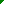

# UPR-SpaceInvaders
Simple space invaders clone using C and SDL2 for Introduction to programming course

> [!NOTE]
> Build with `cmake . -B build` and `cmake --build build`

## Gameplay
Player controls a tower that can move left and right and shoot projectiles to destroy aliens.  
Player is provided additional cover from alien projectiles in the form bunkers, but the player needs to be careful where they shoot, because bunkers can be destroyed by both alien and player projectiles.  
For every alien the player destroys they get certain amount of points added to their score

| Alien                         | Points |
|-------------------------------|--------|
|            | 10     |
|          | 20     |
|            | 30     |
|  | 50-300 |

Aliens move in a swarm from one end of the screen to the other and upon reaching one of the edges they move a bit lower.  
When the player manages to destroy the whole swarm they gain 1 more *life*.  
The aliens randomly shoot projectiles, which when it hits player's tower damages it and decreases the amount of player's *lives*. When the player reaches 0 *lives* the game ends and their score is saved, they have the option to enter their nickname (6 characters), to be shown on the leaderboard in the main menu.

---
## Architecture
The application relevant data is stored in `GameState` struct, which stores the window reference, renderer reference and a boolean that decides if the game window should close and the application should end.  
```c++
typedef struct {
    SDL_Window *window;
    SDL_Renderer *renderer;
    SDL_bool bShouldClose;
} GameState;
```

The game gets initialized in the `main()` function of the application by first initializing the application's `GameState`, which also creates the SDL window and renderer. Then loads all the textures and finally initializes the `GameData` with the default values. 

Every game frame is handled with the main loop which first calls the `Update()` function, then clears the screen and calls the `Render()` function before presenting to the screen.
The loop will run until the `bShouldClose` field in the `GameState` struct isn't set to `TRUE`
```c++
int main()
{
	GameState gameState;
	Init(&gameState);

	GameTextures textures;
	LoadTextures(gameState.renderer, &textures);

	GameData gameData;
	InitGameData(&gameData);

	unsigned long lastTime = SDL_GetPerformanceCounter();
	unsigned long currentTime = 0;

	while (!gameState.bShouldClose) {
		currentTime = SDL_GetPerformanceCounter();;
		double deltaTime = (double)(currentTime - lastTime) / (double)SDL_GetPerformanceFrequency();
		lastTime = currentTime;

		Update(deltaTime, &gameState, &gameData);

		SDL_SetRenderDrawColor(gameState.renderer, 0, 0, 0, SDL_ALPHA_OPAQUE);
		SDL_RenderClear(gameState.renderer);

		Render(&gameState, &textures, &gameData);

		SDL_RenderPresent(gameState.renderer);
	}

	DestroyTextures(&textures);
	Destroy(&gameState);

	return 0;
}
```

Different game phases (main menu, game and game over) are handled with a simple state machine switching between the states/phases defined in the `GamePhase` enum
```c++
typedef enum {
    PHASE_MENU,
    PHASE_PLAYING,
    PHASE_GAME_OVER
} GamePhase;
```

`GameData` stores all the data relevant to the game, like player health, the score, game phase and also all the enemy data.
```c++
typedef struct {
    Player player;
    int score;
    int shots;

    char playerName[7];
    int nameCharIndex;

    HighScore highScores[5];
    int numHighScores;

    GamePhase phase;

    Enemy enemies[NUM_ENEMIES];
    SDL_bool bAlive;

    Bunker bunkers[4];

    Projectile playerProjectile;
    SDL_bool bPlayerProjectileActive;

    Projectile enemyProjectiles[MAX_PROJECTILES];
    int numActiveEnemyProjectiles;

    int alienDirection; // 1 for right, -1 for left
    float alienMoveTimer;
    float alienMoveInterval;

    float alienFireTimer;
    float alienFireInterval;

    float motherShipSpawnTimer;
    float motherShipSpawnInterval;
    int motherShipDirection;
} GameData;
```


## Update Loop
The update loop uses delta time (difference between the previous frame's timestamp and current frame's timestamp) which is used to offset the effects of different frame times.
Without delta time any movement would be dependent on the frame time itself, meaning with shorter frame times (higher frames per second) things would happen quicker, because the update loop would run many more times, than with longer frame times (lower frames per second).
```c++
currentTime = SDL_GetPerformanceCounter();
double deltaTime = (double)(currentTime - lastTime) / (double)SDL_GetPerformanceFrequency();
lastTime = currentTime;

Update(deltaTime, &gameState, &gameData);
```
The delta time gets calculated by comparing the previous and current values of the *high resolution counter* that is accessible from the operating system (done with `SDL_GetPerformanceCounter()`). This gives us the difference between the frames, but different operating systems might use different units for their high resolution counter, so we divide it by the units per second, which we get from `SDL_GetPerformanceFrequency()`, and now we know, that our delta time is now expressed as seconds, but it's a double precision floating point number, because it should preferably not take a second for one frame/update.

### Input
I use `SDL_KEYDOWN` event for single shot actions, like firing.
```c++
while (SDL_PollEvent(&event))
{
    switch (event.type)
    {
        case SDL_QUIT: state->bShouldClose = SDL_TRUE; break;
        case SDL_KEYDOWN: switch (event.key.keysym.sym)
        {
            case SDLK_ESCAPE: state->bShouldClose = SDL_TRUE; break;
            case SDLK_SPACE: if (gameData->bPlayerProjectileActive == SDL_FALSE){
                gameData->bPlayerProjectileActive = SDL_TRUE;
                InitProjectile(&gameData->playerProjectile, (SDL_Point){gameData->player.position.x+12, gameData->player.position.y+10}, PlayerProjectile);
                gameData->shots++;
            }; break;
            default: break;
        }
        default: break;
    }
}
```
This loop is ran every frame, to pop all events from the event queue, if any of the events that happened the previous frame happens to be a `SDL_KEYDOWN` the appropriate switch case is executed.

For continuous input (player movement) I use SDL's KeyboardState array, to check if any specific key is pressed.
```c++
const Uint8 *keystate = SDL_GetKeyboardState(NULL);

// the keystate array is an array which can be indexed with button scancodes
// individual keys/indexes can have a value of either 1 => Pressed or 0 => not pressed
if (keystate[SDL_SCANCODE_LEFT] || keystate[SDL_SCANCODE_A])
{
    int newX = gameData->player.position.x - (int)(moveSpeed * deltaTime);
    if (newX < 0) newX = 0;
    gameData->player.position.x = newX;
}

if (keystate[SDL_SCANCODE_RIGHT] || keystate[SDL_SCANCODE_D])
{
    int newX = gameData->player.position.x + (int)(moveSpeed * deltaTime);
    if (newX > SCREEN_WIDTH - 26) newX = SCREEN_WIDTH - 26;
    gameData->player.position.x = newX;
}
```
### Alien swarm movement
The alien swarm moves as one unit always to one end of the screen, then moving down and going to the other side.
I check if any alien could get out of bounds on the next update to determine if the edge of the screen has been reached, which is useful to react to the changing nature of the swarm due to the player's objective to destroy them.
```c++
gameData->alienMoveTimer += (float)deltaTime;
if (gameData->alienMoveTimer >= gameData->alienMoveInterval) {
    gameData->alienMoveTimer = 0;
    SDL_bool bShouldFlip = SDL_FALSE;

    // Check if ANY alien will hit the edge in the CURRENT direction
    for (int i = 0; i < NUM_ENEMIES-1; i++) {
        if (!gameData->enemies[i].bAlive) continue;

        int nextX = gameData->enemies[i].position.x + (gameData->alienDirection * 15);
        if (gameData->alienDirection == 1 && nextX >= SCREEN_WIDTH - 24) {
            bShouldFlip = SDL_TRUE;
            break;
        }
        if (gameData->alienDirection == -1 && nextX <= 0) {
            bShouldFlip = SDL_TRUE;
            break;
        }
    }

    if (bShouldFlip) {
        gameData->alienDirection *= -1; // Reverse
        for (int i = 0; i < NUM_ENEMIES-1; i++) {
            gameData->enemies[i].position.y += 16; // Move down
        }
    } else {
        for (int i = 0; i < NUM_ENEMIES-1; i++) {
            gameData->enemies[i].position.x += (gameData->alienDirection * 15);
        }
    }
}
```
I loop through the enemy array purposely skipping the last element, because that one is reserved for the mother ship/UFO that moves independently of the swarm.

---
## Bunkers
Bunkers are implemented as an array of individual bunker parts, the bunker's position.
```c++
typedef struct {
    //  /##\ - 4
    //  #/\# - 4
    //  #  # - 2
    // 4+4+2=10
    BunkerPart parts[10];
    SDL_Point position;
    SDL_bool bAlive;
} Bunker;
```

Each bunker part also has position (for collision checks), health, part type from `BunkerType` enum and a boolean field if ts's texture should be flipped as a right side part, because the bunkers are symmetrical.
```c++
typedef enum {
    OuterCorner,
    InnerCorner,
    Block
} BunkerType;

typedef struct {
    BunkerType type;
    SDL_Point position;
    int health;
    SDL_bool bIsRight;
} BunkerPart;
```

| BunkerType  | Texture                               |
|-------------|---------------------------------------|
| OuterCorner |  |
| InnerCorner |  |
| Block       |              |

Each of the textures has multiple versions depending on their health/damage.
